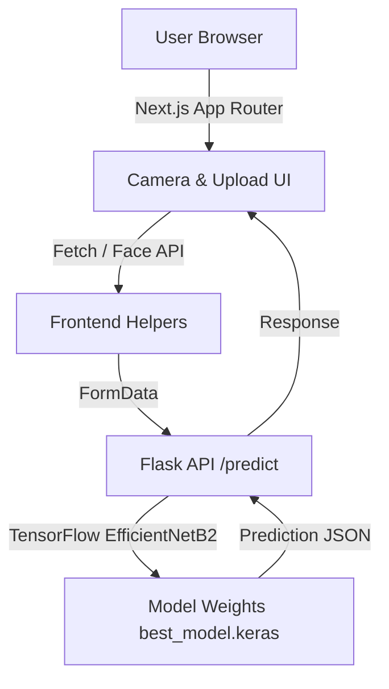

# Face Shape Detection AI

    

> Multi-step camera guidance, smart face validation, and TensorFlow-powered predictions delivered through a polished Next.js interface.

## Table of Contents
- [Overview](#overview)
- [Key Features](#key-features)
- [System Architecture](#system-architecture)
- [User Experience Highlights](#user-experience-highlights)
- [Tech Stack](#tech-stack)
- [Project Structure](#project-structure)
- [Getting Started](#getting-started)
- [Running the Apps](#running-the-apps)
- [API Reference](#api-reference)
- [Model Notes](#model-notes)
- [Troubleshooting](#troubleshooting)
- [Roadmap Ideas](#roadmap-ideas)
- [Acknowledgements](#acknowledgements)

## Overview
Face Shape Detection AI membantu pengguna menemukan bentuk wajah melalui dua alur utama:
1. **Pemindaian kamera multi-langkah** dengan umpan balik live metrics agar setiap sudut wajah terekam dengan akurat.
2. **Upload foto tunggal** dengan validasi otomatis (menggunakan Face API) sebelum diproses model TensorFlow.

Aplikasi ini memadukan pengalaman modern di sisi frontend Next.js dengan model klasifikasi EfficientNetB2 yang dilatih pada lima kategori bentuk wajah (Heart, Oblong, Oval, Round, Square).

## Key Features
- **Camera Wizard**: Tiga langkah pengambilan foto (depan, kiri, kanan) dengan indikator kualitas dan live scoring.
- **Animated Guidance**: Overlay, badges, dan status lighting yang berubah warna (emerald, amber, slate) untuk memberi sinyal kesiapan capture.
- **Smart Validation**: Upload flow memverifikasi keberadaan wajah melalui `face-api.js` sebelum mengirim gambar ke backend.
- **Real-time Metrics**: Deteksi skor overall, posisi, dan skala wajah diperbarui setiap 80 ms demi hasil yang stabil.
- **Reactive State Management**: `@tanstack/react-query` menangani state asynchronous, optimistic reset, dan feedback error.
- **Responsive Layouts**: Antarmuka dipoles dengan Tailwind CSS beserta efek glassmorphism, drop shadow, dan responsive grid.

## System Architecture


## User Experience Highlights
- **Landing Flow**: Pengguna memilih antara pemindaian kamera atau unggah foto. Setiap halaman memiliki header yang konsisten dan CTA sekunder.
- **Camera Guidance**:
  - Sidebar menampilkan progress badge, status tiap orientasi, preview thumbnail, dan CTA capture.
  - Overlay live metrics muncul sebagai kartu semi-transparan yang memperlihatkan skor deteksi, posisi, dan skala.
  - Status teks disertai warna dinamis untuk membimbing pengguna agar memposisikan wajah dengan tepat.
- **Upload Journey**:
  - Drag and drop input (via native file input) dengan preview langsung.
  - Validasi asynchronous dengan spinner dan penanganan error yang informatif.
  - Komponen hasil prediksi menunjukkan bentuk wajah dan confidence dalam tipografi besar.
- **Animations & Micro Interactions**:
  - Ping animation saat analisis berlangsung.
  - Transisi hover pada tombol menggunakan kelas Tailwind.
  - Shadow dan blur yang menimbulkan kesan glass UI serasi dengan tema gelap.

## Tech Stack
**Frontend**
- Next.js 15 (App Router, React 19, TypeScript)
- Tailwind CSS 4 beta + CSS variables
- `@tanstack/react-query` untuk data fetching dan caching
- `face-api.js` untuk validasi kehadiran wajah di sisi client
- `react-webcam` untuk akses kamera berbasis browser

**Backend**
- Flask + CORS
- TensorFlow 2.17 dengan EfficientNetB2 (fine-tuned)
- Pillow dan NumPy untuk preprocessing gambar

## Project Structure
```
faceshapedetection_project/
├── backend/
│   ├── models/best_model.keras
│   ├── requirements.txt
│   └── src/app.py
└── frontend/
    ├── public/models/              # Face API model weights (dimuat di client)
    ├── src/app/
    │   ├── camera/
    │   │   ├── components/         # CameraHeader, CaptureSidebar, CameraViewport, PredictionSummary
    │   │   ├── hooks/useCameraFlow.ts
    │   │   ├── constants.ts
    │   │   ├── types.ts
    │   │   └── utils.ts
    │   ├── upload/
    │   │   ├── components/         # Upload UI fragments & alerts
    │   │   └── hooks/useUploadFlow.ts
    │   ├── layout.tsx
    │   └── page.tsx
    ├── global.d.ts
    ├── tailwind.config.ts
    ├── tsconfig.json
    └── README.md (dokumen ini)
```

## Getting Started
### Prasyarat
- Node.js 20+
- npm (atau pnpm/yarn/bun)
- Python 3.10+
- Pipenv atau virtualenv (opsional, namun disarankan)

### Instalasi Backend
```bash
cd backend
python -m venv .venv
.venv\Scripts\activate   # Windows
pip install -r requirements.txt
```

### Instalasi Frontend
```bash
cd frontend
npm install
```

## Running the Apps
Jalankan kedua layanan pada terminal terpisah.

**Backend**
```bash
cd backend
.venv\Scripts\activate
python src/app.py
```
Server berjalan pada `http://127.0.0.1:5000` dan menyediakan endpoint `/predict`.

**Frontend**
```bash
cd frontend
npm run dev
```
Buka `http://localhost:3000` untuk mengakses UI.

> Pastikan folder `frontend/public/models` berisi file model Face API (`tiny_face_detector_model`, dll). Apabila belum ada, unduh dari repository resmi face-api.js dan letakkan di sana.

## API Reference
### POST /predict
- **Endpoint**: `http://127.0.0.1:5000/predict`
- **Request**: `multipart/form-data` dengan field `image`
- **Optional fields** (dikirim oleh kamera flow):
  - `face_detection_score`
  - `face_overall_score`
  - `face_center_score`
  - `face_size_score`

#### Response
```json
{
  "shape": "Oval",
  "confidence": 0.8421
}
```

#### Error
```json
{
  "error": "Gagal melakukan prediksi."
}
```
Status code 400 diberikan saat file tidak ditemukan, sedangkan 500 menandakan kendala internal (model tidak termuat atau inferensi gagal).

## Model Notes
- Arsitektur: EfficientNetB2 (top layer custom dense softmax lima kelas).
- Input size: 244x244 piksel RGB.
- Bobot disimpan pada `backend/models/best_model.keras` dan dimuat saat startup.
- Preprocessing: resize, konversi ke array, expand dims, tanpa normalisasi tambahan (mengikuti training pipeline).

## Troubleshooting
| Masalah | Penyebab Umum | Solusi |
| --- | --- | --- |
| UI menampilkan pesan memuat model terus menerus | File model Face API belum tersedia di `public/models` | Pastikan semua file `.json` dan `.bin` face-api.js sudah diunduh |
| Error CORS saat memanggil API | Backend belum dijalankan atau port berbeda | Jalankan Flask app di port 5000 atau perbarui `API_URL` di frontend |
| Prediksi lambat | Perangkat tanpa akselerasi GPU | Jalankan backend di lingkungan dengan dukungan AVX/GPU atau gunakan batching |
| Tidak ada wajah terdeteksi | Pencahayaan kurang / kamera diblok | Pastikan wajah berada di tengah frame dan pencahayaan cukup |

## Roadmap Ideas
- Tambahkan penyimpanan riwayat prediksi untuk pengguna.
- Integrasi service worker agar model Face API dapat di-cache offline.
- Implementasi mode dark-light toggle dan pilihan bahasa.
- Deploy backend sebagai serverless function dengan model quantization.

## Acknowledgements
- [face-api.js](https://github.com/justadudewhohacks/face-api.js) untuk kemampuan deteksi wajah di browser.
- Komunitas TensorFlow atas arsitektur EfficientNet.
- Next.js dan React teams atas tooling modern yang memudahkan pengembangan.

---

Dibangun dengan fokus pada pengalaman pengguna: interaktif, informatif, dan siap dikembangkan lebih lanjut.
