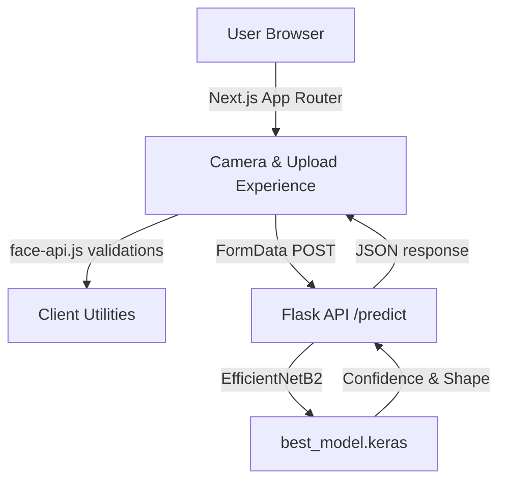

<div align="center">
  
  <h1 style="margin-top: 16px;">✨ Face Shape Detection AI ✨</h1>
  <p>A vivid, animation-forward experience for discovering your face shape with guided camera capture and ML predictions.</p>
  <p>
    
    
    
    
    
  </p>
</div>

---

## 🧭 Quick Navigation
- [Overview](#-overview)
- [Feature Spotlight](#-feature-spotlight)
- [Experience & Visual Design](#-experience--visual-design)
- [Tech Stack](#-tech-stack)
- [Architecture](#-architecture)
- [Project Layout](#-project-layout)
- [Getting Started](#-getting-started)
- [Running the Apps](#-running-the-apps)
- [API Reference](#-api-reference)
- [Model Notes](#-model-notes)
- [Troubleshooting](#-troubleshooting)
- [Roadmap](#-roadmap)
- [Acknowledgements](#-acknowledgements)

## 🌈 Overview
Face Shape Detection AI memadukan **Next.js** untuk antarmuka multi-step yang memukau, **face-api.js** untuk validasi wajah di browser, dan **TensorFlow** di backend guna memprediksi bentuk wajah (Heart, Oblong, Oval, Round, Square).

Pengguna dapat:
1. 📸 Menjalankan wizard kamera tiga langkah dengan live metrics berwarna untuk memastikan pose sempurna.
2. 🖼️ Mengunggah foto tunggal yang otomatis diverifikasi sebelum dianalisis model.

## 🎯 Feature Spotlight
| 🌟 Highlight | Deskripsi |
| --- | --- |
| 🔁 **Multi-Step Camera Flow** | Sidebar progresif dengan badge neon, kartu preview tiap orientasi, serta tombol capture yang responsif terhadap kualitas wajah. |
| 📊 **Live Metrics Overlay** | Panel semi-transparan yang menampilkan skor deteksi, posisi, dan skala secara real-time (80 ms interval). Warna berubah (emerald/amber/slate) mengikuti kondisi wajah. |
| 🧠 **AI-Powered Predictions** | Backend Flask memuat EfficientNetB2 yang sudah fine-tuned untuk lima kelas bentuk wajah. Confidence ditampilkan di UI dengan tipografi besar. |
| 🛡️ **Smart Validation** | Pada upload flow, `face-api.js` mengecek keberadaan wajah sebelum file dikirim. Pesan error dirancang ramah dan informatif. |
| 🎨 **Glassmorphism UI** | Tailwind menghadirkan lapisan blur, shadow lembut, tombol gradien, dan micro animations (hover lift, ping indicator, animated status chips). |
| 📱 **Responsive by Design** | Grid adaptif menjaga pengalaman tetap imersif di mobile hingga desktop besar. |

## 💫 Experience & Visual Design
- **Hero CTA & Links**: Halaman kamera dan upload menampilkan header dengan badge `Face Shape AI`, CTA sekunder, dan copywriting yang memotivasi.
- **Animated Feedback**: Indikator ping, transisi hover, serta status teks yang berubah warna membantu pengguna sepanjang perjalanan.
- **Thematic Consistency**: Palet warna biru-ungu dengan aksen emerald menjaga nuansa futuristik namun ramah.
- **Screenshots / Motion** *(tambahkan file Anda di folder `frontend/docs/` untuk menampilkan gambar nyata)*:
  - ``
  - ``

## 🛠 Tech Stack
**Frontend**
- Next.js 15 (App Router) + React 19
- TypeScript dengan path-based modularisasi
- Tailwind CSS v4 beta (utility-first + custom CSS variables)
- `@tanstack/react-query` untuk data-fetching dan state async
- `face-api.js`, `react-webcam`

**Backend**
- Flask 3 + CORS
- TensorFlow 2.17 (EfficientNetB2)
- Pillow, NumPy untuk preprocessing gambar

## 🧱 Architecture


## 🗂 Project Layout
```
faceshapedetection_project/
├── backend/
│   ├── models/best_model.keras
│   ├── requirements.txt
│   └── src/app.py                # Flask + TensorFlow inference API
└── frontend/
    ├── public/models/            # Face API model weights (client-side)
    ├── src/app/
    │   ├── camera/
    │   │   ├── components/       # CameraHeader, CaptureSidebar, CameraViewport, PredictionSummary
    │   │   ├── hooks/useCameraFlow.ts
    │   │   ├── constants.ts
    │   │   ├── types.ts          # Shared typings (metrics, orientations, etc.)
    │   │   └── utils.ts
    │   ├── upload/
    │   │   ├── components/       # UploadForm, PredictionResult, ErrorAlert, etc.
    │   │   └── hooks/useUploadFlow.ts
    │   ├── layout.tsx
    │   └── page.tsx
    ├── tailwind.config.ts
    ├── tsconfig.json
    └── README.md (dokumen ini)
```

## 🚀 Getting Started
> Jalankan backend & frontend di terminal terpisah.

### 1. Backend Setup
```bash
cd backend
python -m venv .venv
.venv\Scripts\activate  # Windows
pip install -r requirements.txt
python src/app.py
```
Backend berjalan di `http://127.0.0.1:5000`.

### 2. Frontend Setup
```bash
cd frontend
npm install
npm run dev
```
Akses UI di `http://localhost:3000`.

⚠️ **Important**: Pastikan folder `frontend/public/models` berisi file-face-api.js (`tiny_face_detector_model-weights_manifest.json`, dll). Unduh dari repository resmi face-api.js apabila belum tersedia.

## 🧪 Running Lint
```bash
npm run lint
```
Pastikan linting hijau sebelum melakukan commit atau deploy.

## 🔌 API Reference
### `POST /predict`
- **URL**: `http://127.0.0.1:5000/predict`
- **Request**: `multipart/form-data` dengan field `image`
- **Optional Meta** (dikirm kamera flow): `face_detection_score`, `face_overall_score`, `face_center_score`, `face_size_score`

```json
// success
{
  "shape": "Oval",
  "confidence": 0.8421
}
```

```json
// error example
{
  "error": "Gagal melakukan prediksi."
}
```

## 🧠 Model Notes
- EfficientNetB2 tanpa top (pooling=avg) + dense softmax 5 kelas.
- Input: 244×244 RGB, di-preprocess dengan resize, `img_to_array`, `expand_dims`.
- Bobot: `backend/models/best_model.keras`.
- Pastikan environment mendukung TensorFlow (CPU dengan AVX atau GPU).

## 🛟 Troubleshooting
| Issue | Penyebab | Perbaikan |
| --- | --- | --- |
| UI stuck "Memuat model" | File Face API belum diunduh | Pastikan seluruh berkas `.json` dan `.bin` tersedia di `public/models`. |
| `fetch` gagal / CORS | Backend belum hidup atau port berbeda | Jalankan Flask di port 5000 atau sesuaikan `API_URL` pada frontend. |
| Prediksi lama | Hardware tanpa akselerasi | Gunakan mesin dengan GPU / AVX, atau lakukan batching. |
| Wajah tidak terdeteksi | Pencahayaan minim / framing buruk | Posisikan wajah di tengah dengan pencahayaan cukup. |

## 🧭 Roadmap
- 🗂️ Simpan riwayat prediksi pengguna & rekomendasi style personal.
- 🌐 Tambahkan dukungan multi-bahasa & mode gelap/terang.
- 📱 PWA + caching model agar bisa semi-offline.
- ☁️ Deploy backend sebagai serverless function dengan model terkuantisasi.

## 🙌 Acknowledgements
- [`face-api.js`](https://github.com/justadudewhohacks/face-api.js) untuk kemampuan deteksi wajah di browser.
- Tim TensorFlow atas arsitektur EfficientNet.
- Komunitas Next.js & React untuk tooling modern yang mempercepat pengembangan UI.

---

<div align="center">
  <p>Crafted with 💙 to make face-shape discovery feel futuristic, friendly, and fun.</p>
</div>
